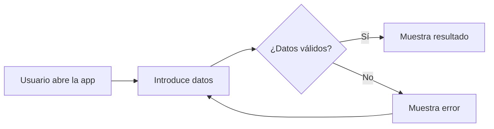

# mini-data-explorer
<h1 align="center">🚀 Proyecto de Exploración sencilla de un csv</h1>

<p align="center">
  <em>Proyecto ejemplo en streamlit de exploración sencilla de un csv.</em>
</p>

<p align="center">
  
  
  
  
</p>

---

## 📸 Proyecto de Exploración sencilla de un csv

<!-- Sustituye esto por una captura, GIF o enlace al deploy -->


🔗 **Demo en vivo:** [https://tu-usuario.github.io/nombre-del-proyecto](https://tu-usuario.github.io/nombre-del-proyecto)

---

## 📋 Tabla de contenidos

- [Descripción](#-descripción)
- [Características](#-características)
- [Tecnologías](#-tecnologías)
- [Instalación](#-instalación)
- [Uso](#-uso)
- [Estructura](#-estructura-del-proyecto)
- [Lo que aprendí](#-lo-que-aprendí)
- [Mejoras futuras](#-mejoras-futuras)
- [Autor](#-autor)

---

## 📖 Descripción

Carga un fichero Csv usando streamlit

---

## ✨ Características

- ✅ Funcionalidad 1
- ✅ Funcionalidad 2
- ✅ Funcionalidad 3
- ✅ Diseño responsive
- ✅ Modo oscuro

---

## 🛠️ Tecnologías

| Tecnología | Para qué |
|------------|----------|
| HTML5      | Estructura |
| CSS3       | Estilos y responsive |
| JavaScript | Lógica e interactividad |
| Git/GitHub | Control de versiones |

---

## ⚙️ Instalación

```bash
# 1. Clonar el repositorio
git clone https://github.com/randyb12019-repo2026/mini-data-explorer.git

# 2. Entrar en la carpeta
cd nombre-del-proyecto

# 3. Abrir index.html en el navegador
# (o usar Live Server en VS Code)
```

> Si tu proyecto usa Node, añade aquí `npm install` y `npm run dev`.

---

## 💡 Uso

Explica cómo usar la app paso a paso. Si hay funcionalidades clave, descríbelas con una captura al lado.

1. Abre la aplicación
2. Pulsa el botón "X"
3. Introduce los datos en "Y"
4. ¡Listo!

---

## 📁 Estructura del proyecto

```
nombre-del-proyecto/
├── index.html
├── css/
│   └── styles.css
├── js/
│   └── app.js
├── assets/
│   └── img/
└── README.md
```

---

## 🔄 Flujo de la aplicación



---

## 🎓 Lo que aprendí

- Punto interesante 1 que aprendiste
- Reto técnico que superaste
- Concepto que entendiste haciendo el proyecto

---

## 🚧 Mejoras futuras

- [ ] Añadir login con Google
- [ ] Conectar con una API externa
- [ ] Mejorar accesibilidad
- [ ] Añadir tests

---

## 👤 Autor

**Tu Nombre**

- 🐙 GitHub: [@tu-usuario](https://github.com/tu-usuario)
- 💼 LinkedIn: [Tu Nombre](https://linkedin.com/in/tu-usuario)
- ✉️ Email: tu@email.com

---

<p align="center">
  Si te gustó el proyecto, déjale una ⭐ en GitHub
</p>
 